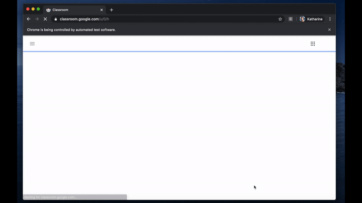

# AttendanceBot
AttendanceBot is a bot used to automate filling out Google Forms for school attendance. 

## Features
During the current COVID-19 pandemic, many students no longer attend school, instead, participating in "distanced learning".
Nevertheless, schools still have to take attendance, and many do this by having students fill out Google Forms. 

This bot automates signing in for attendance by:
- Logging student(s) into Google Classroom
- Going to their School's dedicated Google Classroom attendance page
- Finding a post with the current month and day of month in the title
- Finding a Google Forms link in the attachments of the post
- Filling out this Google Form with the specified values

## Demo


## Before you continue
This is a proof of concept and is tailored to my school's attendance system. 
That being said, the bot can be configured to fit your situation using a JSON configuration file. 
The syntax for this file can be found in the [Usage section](https://github.com/thatcherclough/AttendanceBot#Usage).

## Requirements
- A Java JDK distribution >=8 must be installed and added to PATH.
- Google chrome must be installed. 
- A compatible version of [Chrome Driver](https://chromedriver.chromium.org/) must be downloaded.

## Installation
```
# clone AttendanceBot
git clone https://github.com/thatcherclough/AttendanceBot.git

# change the working directory to AttendanceBot
cd AttendanceBot

# build AttendanceBot with Maven
# for Windows run
mvnw.cmd clean package

# for Linux or Mac run
sh mvnw clean package
```

Alternatively, you can download the jar from the [release page](https://github.com/thatcherclough/AttendanceBot/releases).

## Usage
```
java -jar attendancebot.jar
AttendanceBot: A bot used to automate filling out Google Forms for school attendance (1.0.0)

Usage:
	java -jar attendancebot.jar [-h] [-v] [-f CONFIG JSON FILE]

Arguments:
	-h,  --help		Display this message.
	-v,  --version		Display current version.
	-f,  --file		Specify JSON configuration file. (See README for example)
```

Attendance Bot uses a JSON configuration file. Below is an example file along with what each key represents:
```
{
  "log_file": "output.log",
  "email_notifications":
  {
    "sender_email": "spam@gmail.com",
    "sender_password": "SpamEmailPassword",
    "receiver_email": "main@gmail.com"
  },
  "chromedriver_executable": "chromedriver.exe",
  "time_to_run": "09:00:00",
  "default_wait_in_millis": "5000",
  "run_duration_in_minutes": "10",
  "randomize_order_of_students": "true",
  "student_info": [
    {
      "email": "smithj@school.org",
      "password": "JoeSmit123",
      "google_class_link": "https://classroom.google.com/u/0/c/GUtfGYghuikJ",
      "cssSelectorsWithActions": [
        {"cssSelector_for_first_name_input_field": "Joe"},
        {"cssSelector_for_last_name_input_field": "Smith"},
        {"cssSelector_for_grade_input_field": "Freshman"},
        {"cssSelector_for_submit_button": "click"}
      ]
    },
    {
      "email": "serbeej@otherschool.org",
      "password": "ILOVEPUPPIES888",
      "google_class_link": "https://classroom.google.com/u/0/c/tyHUNhtfCghj",
      "cssSelectorsWithActions": [
        {"cssSelector_for_name_input_field": "Jake Serbee"},
        {"cssSelector_for_submit_button": "click"}
      ]
    }
  ]
}
```
`log_file`:
Necessary. Specifies the path of the file to log bot activity to.

`email_notifications`:
Optional. Specifies the G-mail address(es) to be used for sending and receiving bot activity to/from. 
`sender_email` and `sender_password` are used for specifying the G-mail address to send bot activity from.
This email must have 3rd party access enabled [here](https://myaccount.google.com/lesssecureapps). 
`receiver_email` specifies the email that bot activity should be sent to.

`chromedriver_executable`:
Necessary. Specifies the path to the Chrome Driver executable mentioned in the [requirements section](https://github.com/thatcherclough/AttendanceBot#requirements).

`time_to_run`:
Necessary. Specifies the time to start the bot every weekday.

`default_wait_in_millis`:
Necessary. Specifies the time to wait between performing different actions.
This should be higher on slower computers to ensure no errors arise.

`run_duration_in_minutes`:
Optional. This is used when signing multiple people in. Specifies a time frame in which all students should be signed in.
Sign in times are equally distributed over this time frame.

`randomize_order_of_students`:
Optional. This is used when signing multiple people in. Specifies if students should be signed in in a random order. 

`student_info`:
Necessary. Specifies student information. For each student `email` and  `password` specify the email and password
to their Google Account. `google_class_link` specifies the link to their school's dedicated Google Classroom attendance page.
`cssSelectorsWithActions` is a list of CSS Selectors paired strings. If this string is 'click', the WebElement with that CSS Selector is clicked.
Otherwise, it is assumed that the CSS Selector represents a text field, and the string is typed into that text field. In Google Chrome, 
to find the CSS Selector of an element on the page, left click this element and select 'inspect element'. Then right click the highlighted part of the HTML, move the cursor
 to 'copy' and click 'CSS Selector'. 

## License
- [MIT](https://choosealicense.com/licenses/mit/)
- Copyright 2020 © Thatcher Clough.
